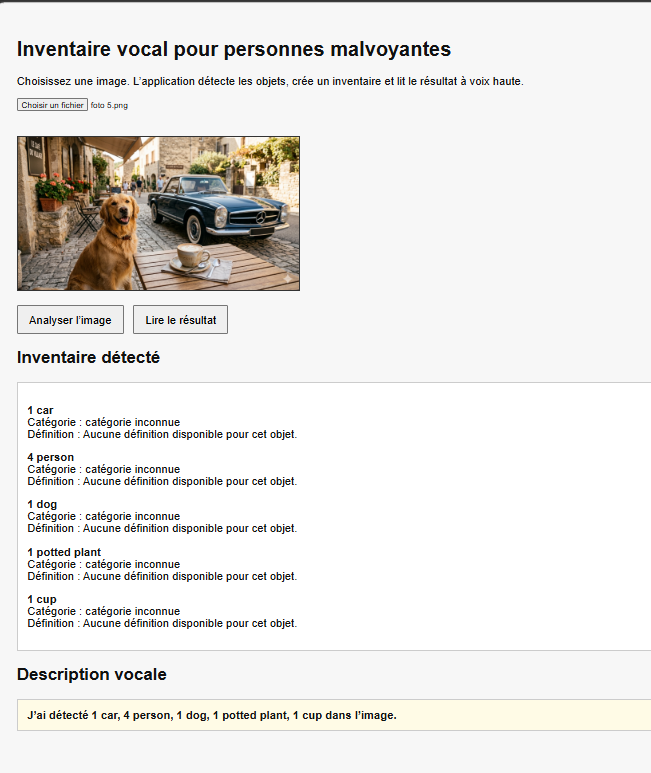

# GUIDE D' UTILISATION 

## Présentation de l’application

Cette application permet de générer un inventaire vocal à partir d’une image.

Elle a été pensée comme une aide pour les personnes malvoyantes : l’utilisateur importe une image, l’application détecte les objets présents, affiche un inventaire lisible et lit le résultat à voix haute.

---

## Comment utiliser l’application

1. Ouvrir l’application dans un navigateur.

2. Cliquer sur **“Choisir un fichier”**.

3. Sélectionner une image depuis l’ordinateur.

4. Cliquer sur **“Analyser l’image”**.

5. L’application affiche les objets détectés avec leur quantité, leur catégorie et leur définition.

6. Le résultat est également lu à voix haute.

7. Le bouton **“Lire le résultat”** permet de réécouter la description vocale.

---

## Exemple de résultat

### 1 voiture

**Catégorie :** transport

**Définition :** Une voiture est un véhicule utilisé pour se déplacer.

---

### 4 personne

**Catégorie :** être humain

**Définition :** Une personne est un être humain.

---

### 1 chien

**Catégorie :** animal

**Définition :** Un chien est un animal domestique.

---

### 1 plante en pot

**Catégorie :** objet du quotidien

**Définition :** Une plante en pot est une plante cultivée dans un récipient.

---

### 1 tasse

**Catégorie :** objet du quotidien

**Définition :** Une tasse est un récipient utilisé pour boire une boisson.

---

## Phrase vocale générée

> J’ai détecté 1 voiture, 4 personne, 1 chien, 1 plante en pot, 1 tasse dans l’image.

---

---
# Objectif utilisateur

L’objectif est de rendre une image plus accessible grâce à une description automatique, simple et vocale.